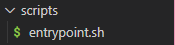
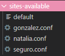
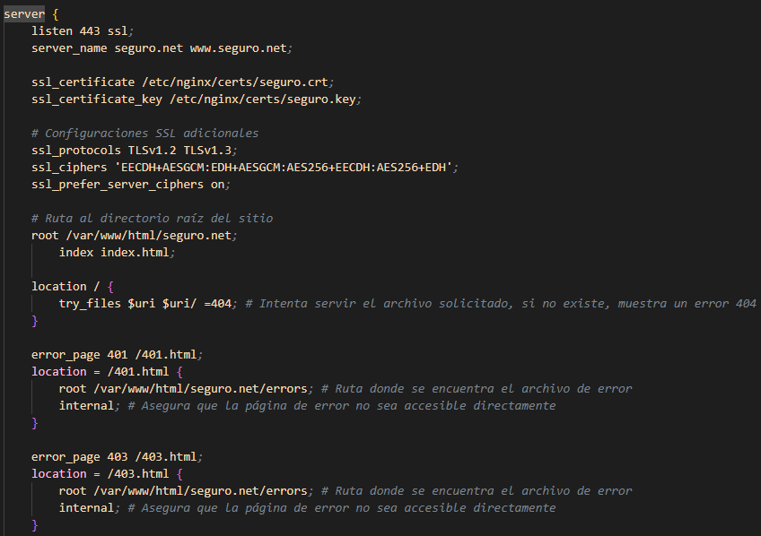
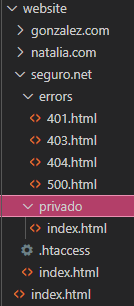
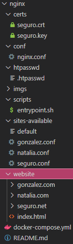

## NATALIA.COM

Creamos una carpeta “conf” donde metemos el fichero nginx.conf de nuestro sistema de Linux.

 
Creamos el directorio sites-available, donde se guardan todos los archivos de configuración de los sitios disponibles para Nginx.

 
Creamos la estructura básica del sitio web para natalia.com en una carpeta websites. Cuenta con una página principal (index.html) que los usuarios verán al ingresar al dominio, y una página personalizada de error 404 (error404.html).

 
En el archivo natalia.conf, debemos configurar varios parámetros para nuestro servidor web.
1.	listen: especifica el puerto en el que se ejecutará el sitio web.
2.	server_name: define el nombre del dominio principal para el servidor y su alias.
3.	root: define el directorio raíz desde donde se servirán los archivos para este dominio. En este caso /var/www/natalia.com.
4.	index: especifica que el archivo index.html será el archivo predeterminado que se cargará cuando un usuario acceda al dominio.
5.	location: especifica una página personalizada para errores 404
6.	error_log: define la ubicación donde se almacenarán los logs de errores.
7.  access_log: define la ubicación donde se almacenarán los logs de acceso.

 
Creamos un fichero docker-compose. Debe de lucir de la siguiente forma:

 
Debemos tener una carpeta scripts con nuestro fichero entrypoint.sh

 
En nuestro entrypoint.sh debemos añadir los siguientes comandos para automatizar la creación de nuestro servicio con su configuración. 
1.	ln -s: crea enlaces simbólicos de los archivos de configuración de sites-available a sites-enabled.
2.  nginx -s reload: recarga la configuración de Nginx.
3.  nginx -g 'daemon off;': inicia Nginx en primer plano.

 
En nuestro fichero hosts debemos añadir nuestro dominio con la IP de nuestro localhost.
 

## GONZALEZ.COM

En el directorio sites-available, agregamos el archivo gonzalez.conf.

 
En el archivo gonzalez.conf, debemos configurar varios parámetros para nuestro servidor web.

 
Creamos la estructura básica del sitio web para gonzalez.com en la carpeta websites. Cuenta con una página principal (index.html) que los usuarios verán al ingresar al dominio, y una página personalizada de error 404 (error404.html).
 

Añadimos el enlace simbólico del archivo .conf al fichero entrypoint.sh.

 
En nuestro fichero hosts debemos añadir nuestro dominio con la IP de nuestro localhost.
 

## SEGURO.NET

En el directorio sites-available, agregamos el archivo seguro.conf.

 
En el archivo seguro.conf, debemos configurar varios parámetros para nuestro servidor web. En el puerto 80:
1.	ServerName: define el nombre del dominio principal para el servidor.
2.	ServerAlias: permite añadir alias adicionales para el dominio. Se redirije al dominio principal, aunque no se escriba http:// delante de la URL.
3.	Redirect: redirige todas las solicitudes HTTP a la versión segura HTTPS del sitio web.

En el puerto 443:
1.	ServerAdmin: especifica el correo electrónico del administrador del servidor.
2.	DocumentRoot: especifica la ruta en el sistema donde se encuentran los archivos del sitio web.
3.	ServerName: define el nombre del dominio principal para el servidor.
4.	ServerAlias: permite añadir alias adicionales para el dominio. Se redirije al dominio principal, aunque no se escriba http:// delante de la URL.
5.	SSLEngine On, SSLCertificateFile, SSLCertificateKeyFile: configuran el SSL para el dominio, especificando el archivo del certificado y la clave privada necesarios para una conexión segura.
6.	SSLProtocol All -SSLv3: asegura que solo se utilicen protocolos seguros, deshabilitando SSLv3.
7.	<Directory /var/www/>: define permisos y opciones para los archivos dentro del directorio /var/www/. 
    * Las opciones Indexes y FollowSymLinks permite la navegación por índices de directorios y el seguimiento de enlaces simbólicos.
    * AllowOverride All permite que las configuraciones de .htaccess sobrescriban configuraciones generales del servidor.
    * Require all granted asegura que todos los usuarios puedan acceder al contenido.
8.	ErrorDocument 401 /error/error401.html: especifica una página personalizada para errores 401.
9.	ErrorDocument 403 /error/error403.html: especifica una página personalizada para errores 403.
10.	ErrorDocument 404 /error/error404.html: especifica una página personalizada para errores 404.
11.	ErrorDocument 500 /error/error500.html: especifica una página personalizada para errores 500.

 
Creamos la estructura básica del sitio web para seguro.com en la carpeta websites. Cuenta con una página principal (index.html) que los usuarios verán al ingresar al dominio, y una página personalizada de error 404 (error404.html), error 401 (error401.html), error 403 (error403.html) y error 500 (error500.html). Aparte, cuenta con una página única para usuarios aptos
 

Añadimos el enlace simbólico del archivo .conf al fichero entrypoint.sh.

Creamos las carpetas certs y htpasswd

Ejecutamos el comando openssl passwd. Ponemos la contraseña que queramos.

Copiamos la contraseña a un archivo .htpasswd con el nombre del usuario.

En la consola de OpenSSL, ponemos el comando openssl req -x509 -nodes -days 365 -newkey rsa:2048 -keyout seguro.key -out seguro.crt.
Ahora registraremos el país, provincia, localidad, organización, nombre, dominio y email.

 
En nuestro fichero hosts debemos añadir nuestro dominio con la IP de nuestro localhost.
 

Ejecutamos el Docker.

Al final de todo, nuestro directorio debe tener la siguiente estructura:

